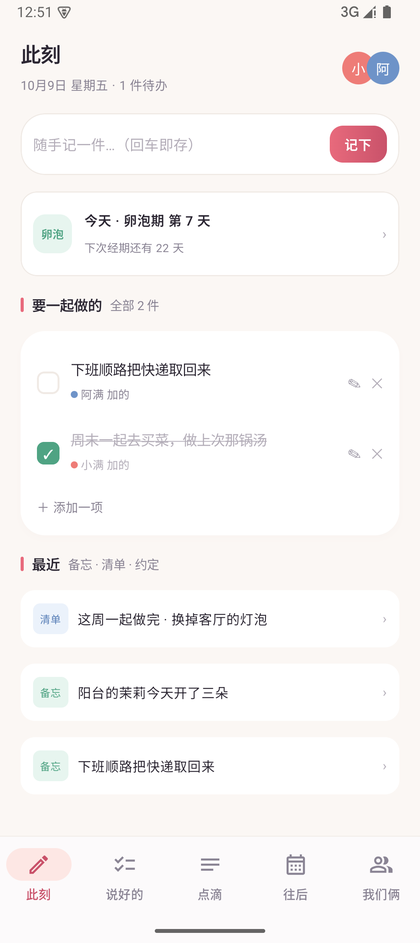
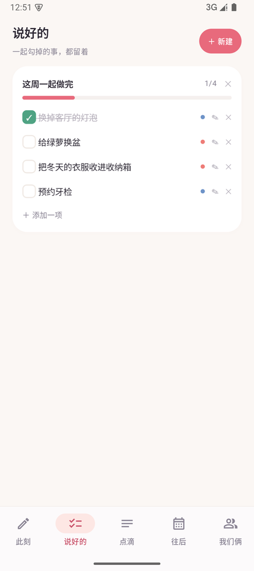
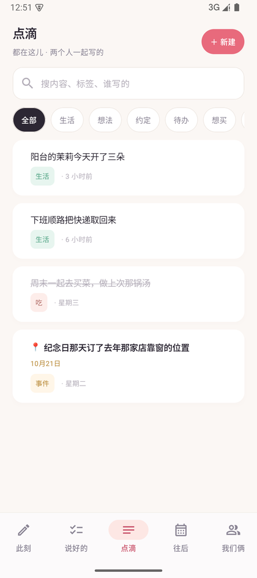
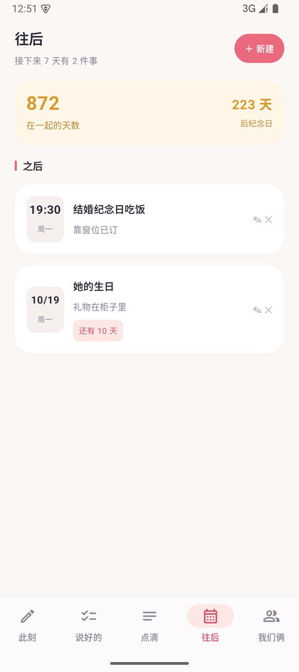
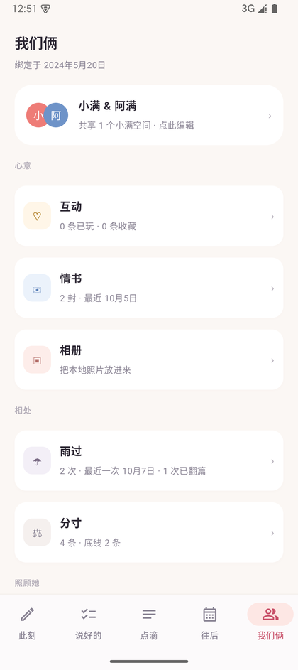
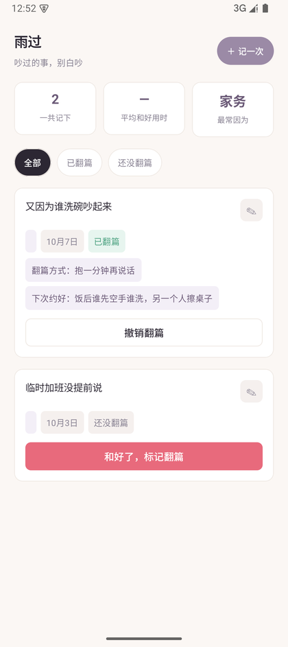
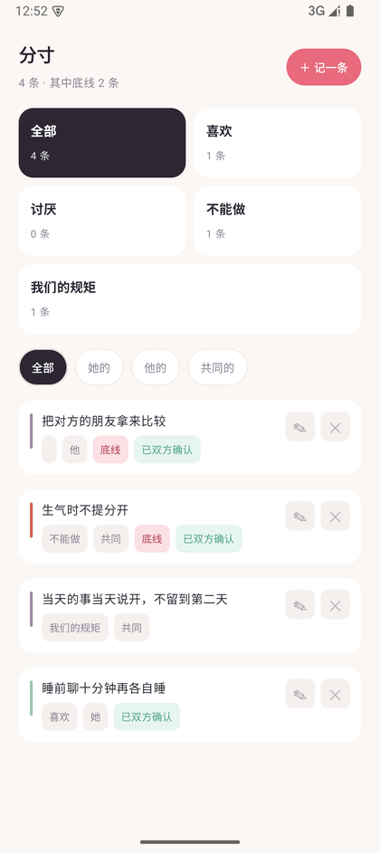
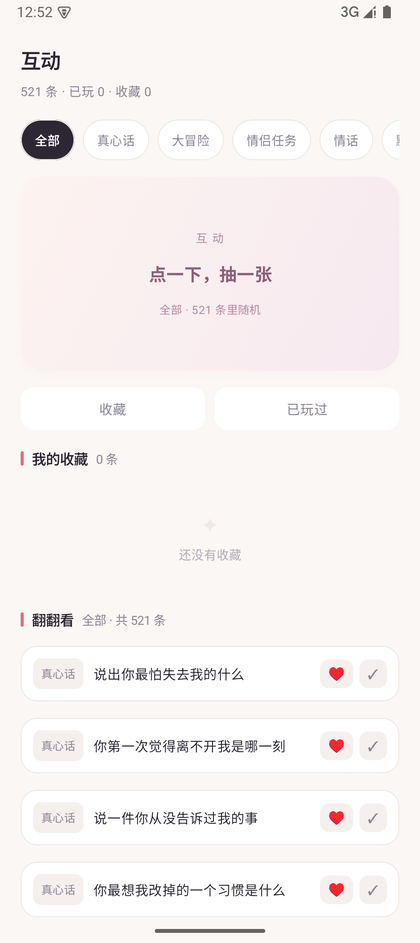
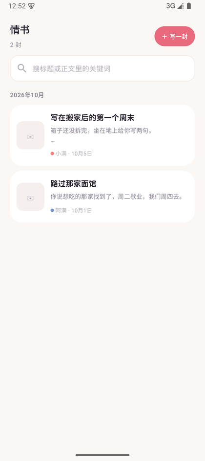
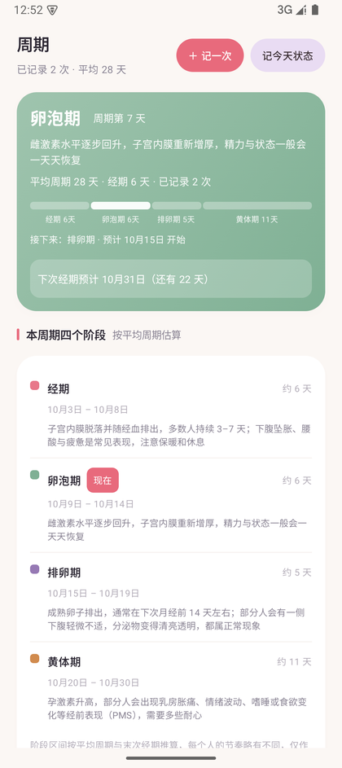

# 小满 · 相伴

> 小得盈满，未满方有期待 —— 记的都不是大事，攒起来是圆满。


-3DDC84?logo=android&logoColor=white)


[](https://github.com/ChencLi819/xiaoman-xiangban/actions/workflows/android-ci.yml)

一款给两个人用的**情侣备忘录**。不是日记，是轻、快、结构化的共同记忆：
一句话的碎碎念、说好的约定、吵完架的和好、还有那些没说出口的话。

---

## 它是什么

两个人共用一个空间记录日常。所有内容**默认只存在你们自己的设备上**，
需要跨设备时则通过你自己指定的 WebDAV 网盘做端到端加密同步 —— 密钥由你俩的配对码派生，网盘方只能看到密文。

**没有账号体系、没有后台服务器、没有第三方 SDK、没有数据统计与埋点。**

### 界面

主流程 5 个 Tab：

<p float="left">
  
</p>
<p align="left">
  <sub>此刻 · 速记与今日待办 ｜ 说好的 · 共享清单 ｜ 点滴 · 全部备忘 ｜ 往后 · 约定倒计时 ｜ 我们俩 · 聚合入口</sub>
</p>

各板块内部：

<p float="left">
  
</p>
<p align="left">
  <sub>雨过 · 吵架记录与翻篇 ｜ 分寸 · 偏好与边界 ｜ 互动 · 抽一张 ｜ 情书 · 按月归档 ｜ 周期 · 四阶段与预测</sub>
</p>

> 截图来自 Android 15 模拟器（1080×2424，浅色模式），界面内容为**演示数据**，非真实用户记录。

---

## 功能一览

### 主流程（底部 5 个 Tab，可左右滑动翻页）

| 页面 | 说明 |
| --- | --- |
| **此刻** | 速记条回车即存，想到什么随手一记 |
| **说好的** | 共享清单，勾选留痕，完整增删改 |
| **点滴** | 全部备忘，标签 + 关键词检索筛选 |
| **往后** | 约定与纪念日倒计时 |
| **我们俩** | 聚合页：身份切换、双方名字与纪念日、数据导入导出 |

### 相处

- **雨过**：吵架记录。四选一归因（怪我 / 怪 TA / 各退一步 / 说不清）+ 情绪 + 火气 5 级，和好后「标记翻篇」
- **说开了**：复盘与沉淀，「下次我们约好」可一键沉淀为约定
- **抽一张**：翻篇抽签，内置 520 条 + 支持自己增删改
- **分寸**：喜欢 / 讨厌 / 不能做 / 我们的规矩 × 她 / 他 / 共同，底线置顶，可标「需要对方确认」

### 心意

- **互动 / 互动库**：520 条（真心话 110 · 大冒险 100 · 情侣任务 110 · 情话 109 · 默契问答 91），优先抽没玩过的，支持收藏与四维筛选
- **情书**：按月归档、关键词搜索、可插入图片，双色作者区分
- **相册**：系统选择器批量导入，按月分组，可改归属与备注

### 照顾她

- **周期**：经期记录与生理阶段描述（经期 / 卵泡期 / 排卵期 / 黄体期）、日历标记、下次经期推算

> 周期板块**严格只做生理学叙述**：记录经期、描述生理阶段、推算下次经期。
> 不提供易孕区间、安全期等任何生育相关内容。

### 系统级能力

- **桌面小部件**：2×1「TA 还没写 / 你已写 N 条 + 一键记一条」、4×2「共同待办 + 周期状态」，数据变更即刷新
- **App Shortcuts**：长按图标直达「记一条 / 写情书 / 抽一张」
- **每日提醒**：单一通知 channel，WorkManager 定时检查今日约定、未完成待办、经期开始日
- **深链**：`xiaoman://`

---

## 隐私

| 项目 | 情况 |
| --- | --- |
| 账号注册 | 无 |
| 后台服务器 | 无（同步走你自己的网盘） |
| 第三方 SDK / 埋点 | 无 |
| 默认数据位置 | 仅设备本地 Room 数据库 |
| 同步内容加密 | 配对码派生 AES-GCM，网盘方只见密文 |
| 「仅我看」条目 | 不参与同步（连删除标记都不上传） |
| 权限 | 仅 `POST_NOTIFICATIONS`、`RECEIVE_BOOT_COMPLETED`、`INTERNET` 三项；本地端（local flavor）不发起任何网络请求 |

完整说明与其边界（明文 HTTP 的取舍、`allowBackup`、配对码强度、待清理的多余权限）见
[docs/privacy.md](docs/privacy.md)；发现安全问题请按 [SECURITY.md](SECURITY.md) 私下上报，不要公开提 Issue。

---

## 两个版本

同一套业务代码，两个 Gradle flavor 并行出包：

| flavor | 应用名 | 包名 | 说明 |
| --- | --- | --- | --- |
| `local` | 小满 | `com.xiaoman.memo` | 纯离线单机版，无同步 UI |
| `sync` | 小满·相伴 | `com.xiaoman.memo.sync` | 带 WebDAV 双端同步 |

### 同步怎么用（sync 版）

1. 一方点「发起配对」，自动生成 **6 位配对码**
2. 在任意 WebDAV 网盘（坚果云 / Nextcloud / 群晖 NAS / 自建都行）里准备 `/xiaoman-<配对码>` 目录
3. 两台设备各填自己的网盘凭据 + 同一个目录路径，一方「发起方」、一方「加入方」

技术上：发起方写 `host.json`、加入方写 `guest.json`（文件级无写冲突），全量快照 + AES-GCM 加密；
合并对所有同步表用同一套语义 —— 按 `uuid` 对齐、`updatedAt` 后写胜出、删除以墓碑传播，平手时发起方胜出并记录冲突数。
「标记翻篇」没有特殊规则，它只是一次带新 `updatedAt` 的普通修改。
触发时机只有三个：打开 App、数据变更后 15 秒防抖、手动点「立即同步」。

协议细节、合并规则表与已知取舍见 [docs/sync.md](docs/sync.md)；同步出问题时先按
[docs/troubleshooting.md](docs/troubleshooting.md) 自查。

> 坚果云需在网页版生成「应用密码」；Nextcloud 地址形如 `https://域名/remote.php/dav/files/用户名/`。

---

## 快速开始

```bash
# 要求：JDK 17、Android SDK（compileSdk 35）
cd android

./gradlew assembleLocalDebug   # 本地端：小满
./gradlew assembleSyncDebug    # 同步端：小满·相伴

./gradlew test                 # 跑单元测试（CycleMath / Merge）
```

首次构建前创建 `android/local.properties`（该文件不入库），填你自己的 SDK 路径：

```properties
sdk.dir=<你的本机 Android SDK 路径>
```

产物命名：`android/app/build/outputs/apk/<flavor>/<buildType>/xiaoman-<flavor>-v<version>-<buildType>.apk`

不想搭环境的话，CI 每次都会构建两个 flavor 的 debug APK，可在
[Actions 运行页](https://github.com/ChencLi819/xiaoman-xiangban/actions?query=branch%3Amain) 的产物（artifact）里下载。
注意 `release` 包用 debug 密钥自签（自用分发），不是正式签名，上架渠道请自行签名。

---

## 技术栈

| | |
| --- | --- |
| 语言 | Kotlin，JDK 17 |
| UI | Jetpack Compose (BOM 2024.10) + Material 3 |
| 导航 | Navigation-Compose |
| 数据 | Room 2.6.1 (KSP)、DataStore Preferences |
| 后台 | WorkManager |
| 网络 | OkHttp（仅 sync flavor 的 WebDAV） |

`minSdk 26` / `targetSdk 35` / `compileSdk 35`。深色模式完整适配，含日历与抽卡彩色区块的降饱和处理。

---

## 目录结构

```
.
├── android/                     # Gradle 工程根（打开项目时选这个目录，不是仓库根）
│   └── app/src/main/java/com/xiaoman/memo/
│       ├── data/                # Room 实体 / DAO / DB + Migration、SettingsStore、
│       │                        # AppViewModel、Backup、SyncEngine、SyncTransport
│       ├── domain/              # 纯逻辑，可 JVM 单测：CycleMath、Merge、Quarrel、Tags、Pools
│       ├── ui/
│       │   ├── theme/           # 双色身份系统（她 #EE7C77 / 他 #6E93C8）浅深色板
│       │   ├── components/      # 通用卡片 / chips / 翻卡动画
│       │   ├── nav/             # 5 Tab + 子路由 + 深链
│       │   └── screens/         # 各功能页
│       ├── widget/              # 2×1 / 4×2 桌面小部件
│       └── remind/              # 通知 channel + 每日提醒 Worker
├── docs/
│   ├── technical.md             # 架构与关键实现取舍
│   ├── sync.md                  # 同步协议：配对 / 传输 / 加密 / 合并规则
│   ├── privacy.md               # 隐私设计、权限、边界与已知问题
│   ├── troubleshooting.md       # 故障排查（同步自查、数据恢复、构建问题）
│   ├── prototype/               # HTML 交互原型（也是种子数据的生成来源）
│   └── screenshots/             # README 用的界面截图
├── tools/                       # 辅助脚本，不参与 Gradle 构建
├── .github/                     # Issue / PR 模板、CI
├── CHANGELOG.md · CONTRIBUTING.md · SECURITY.md
└── README.md
```

## 文档

| 我想了解 | 看哪里 |
| --- | --- |
| 代码怎么组织、为什么这样实现 | [docs/technical.md](docs/technical.md) |
| 同步的协议、加密与合并规则 | [docs/sync.md](docs/sync.md) |
| 数据存在哪、权限、隐私边界与已知问题 | [docs/privacy.md](docs/privacy.md) |
| 同步/构建/提醒出问题怎么排查 | [docs/troubleshooting.md](docs/troubleshooting.md) |
| 改了什么、版本历史 | [CHANGELOG.md](CHANGELOG.md) |
| 怎么跑起来、怎么提 PR | [CONTRIBUTING.md](CONTRIBUTING.md) |
| 怎么报告安全问题 | [SECURITY.md](SECURITY.md) |
| 调试用的脚本 | [tools/README.md](tools/README.md) |
| 最初的设计原型 | [docs/prototype/情侣备忘录-原型.html](docs/prototype/情侣备忘录-原型.html) |
| 界面截图（演示数据） | [docs/screenshots/](docs/screenshots/README.md) |

---

## 参与

Issue 和 PR 都欢迎，请先读 [CONTRIBUTING.md](CONTRIBUTING.md)。改动前留意三条硬约定：

- 出包约定：`local` 与 `sync` **两个 flavor 都要能构建通过**（CI 已分别验证）
- 给同步表加字段要改**五处**：实体字段、数据库版本 + 手写 Migration、备份导出、备份导入、同步快照导出与合并读取 —— 少一处就会出现「本机能写、对方看不到」
- 周期板块**不要引入任何生育视角内容**（易孕区间 / 安全期 / 备孕 / 避孕）

数据库变更只走递增版本 + 手写 Migration，禁止破坏性重建；改合并语义必须补单测。

发现安全问题请按 [SECURITY.md](SECURITY.md) 私下上报。

---

## 许可证

[MIT](LICENSE) © 2026 ChencLi819
